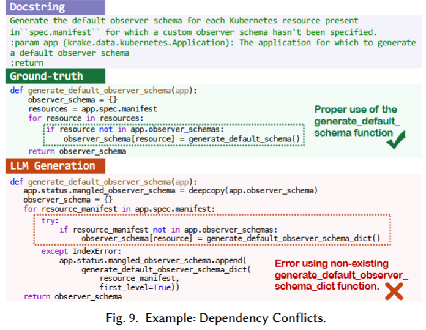
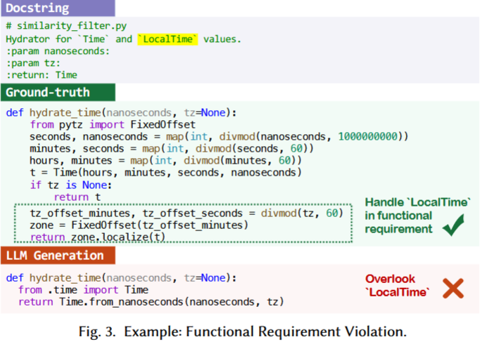

# Topic-2_Guidelines.md

> **Template for Student Guideline Packages**  
> _Fill in the bracketed sections `[...]` with your team's curated content._

---

## Team Information

**Team Name:** `Team 2`  
**Topic:** `Coding`  
**Date:** `12.04.2026`  
**Authors:** `Iven Beck, Petar Malamov, Denis Maxheimer, Richard Plummer`

---

## 1. Unified Guidelines

> **Note:** These are the merged, refined guidelines that your team recommends to the class. Each guideline should be actionable, specific, and usable during real SE/coding tasks.

### Guideline 1: Context-Aware Grounding via Minimal Manual Documentation

**Description:**  
Ground LLM generation in project-specific context by providing manual, minimal context files (like AGENTS.md) and injecting relevant symbols, dependency graphs, and existing patterns into the prompt, rather than relying on auto-generated summaries or isolated function requests.

**Reasoning:**  
Zhang et al. (2025) highlight that over 70% of functions in practical development are not standalone but depend on project-specific entities, which LLMs often "hallucinate" if context is missing. Furthermore, Gloaguen et al. (2026) empirically demonstrated that developer-written, minimal context files outperform LLM-generated ones—which can actually reduce success rates by ~3% and increase costs—precisely because they contain non-redundant, specific info.

**Example:**  
A minimal context file (AGENTS.md) specifying: 
```
- Use `uv` for package management.
- Logging: Use the custom wrapper in `src/utils/logger.py`.
- Database: All queries must use the `QueryBuilder` interface.
```

**When to Apply:**  
When working within existing codebases with established architectural patterns, custom internal APIs, or specific configuration requirements.

**When to Avoid:**  
Standalone logic puzzles, small greenfield scripts, or when the project has no unique constraints or dependencies.

---

### Guideline 2: Interactive Test-Driven Validation (TDD-LLM)

**Description:**  
Supply human-verified unit tests alongside problem statements in the prompt. Use these tests as a "source of truth" to formalize requirements, prune incorrect code candidates, and clarify ambiguous natural language intent through interactive feedback.

**Reasoning:**  
Mathews & Nagappan (2024) found that providing tests in prompts improves correctness by up to 18% by disambiguating prose. Fakhoury et al. (2024) also showed that execution-based filtering significantly reduces the developer's cognitive load by removing plausibly correct but logically flawed suggestions that humans often miss during manual review.

**Example:**  
Prompt the LLM: "Write a function to sanitize filenames. Use these tests to verify: 
```python
assert sanitize("file name.txt") == "file_name.txt"
assert sanitize("../../etc/passwd") == "etc_passwd"
```

**When to Apply:**  
Algorithmic implementation, data transformation, or any task where functional correctness can be expressed through discrete inputs and outputs.

**When to Avoid:**  
UI/UX ideation, exploratory design, or generic documentation tasks where automated testing is impractical.

---

### Guideline 3: Iterative Remediation and Self-Correction Loops

**Description:**  
Implement a structured "Plan-Execute-Review" loop. Treat the first output as a draft; feed failed test execution output (tracebacks, logs) back into the model for remediation. Complement this with a secondary "Reviewer" turn to force the model to critique its own logic for "silent" hallucinations like security flaws or performance bottlenecks.

**Reasoning:**  
Zhang et al. (2025) identify that silent hallucinations (security risks, incomplete functionality) are the most dangerous as they pass syntax checks. Mathews & Nagappan (2024) demonstrated that 3–5 iterations of remediation using failed test information add a critical ~5% improvement in solving complex problems. Claude and GPT experiments confirm that LLMs are better at identifying errors in existing text than avoiding them during initial generation.

**Example:**  
1. LLM generates code. 
2. Execution fails with `ImportError`. 
3. User feeds back: "Failed with ImportError: module 'x' not found. Update the implementation." 
4. LLM corrects imports.

**When to Apply:**  
Production-level code, critical security modules, or complex refactoring tasks where the first-shot success rate is known to be lower.

**When to Avoid:**  
Extremely simple boilerplate generation where the cost of verification/iteration outweighs the risk of trivial bugs.

---

### Guideline 4: Atomic Task Decomposition with Systematic Reasoning

**Description:**  
Break complex, multi-step requirements into atomic, testable units (functions/modules) before prompting. For each unit, use Few-Shot Chain-of-Thought (CoT) prompting—providing 2–5 worked examples that include both the reasoning process and the final code.

**Reasoning:**  
LLM performance degrades significantly with task complexity and context length (Schulhoff et al., 2025). Experimentation with Qwen and Gemma reinforces that atomicity reduces logical drift. Schulhoff's systematic survey identifies Few-Shot CoT as one of the best-performing techniques for guiding models through the "how" and "what" of production-level coding.

**Example:**  
Instead of "Build a full data ingestion pipeline," first prompt for "A function to parse the raw headers," providing two examples of header parsing logic and the reasoning (e.g., "Strip whitespace, then map to keys").

**When to Apply:**  
Non-trivial logic, implementing new features, or multi-step architectural changes.

**When to Avoid:**  
Well-defined standard boilerplate or when using extremely large-context models for very small scripts.

---

### Guideline 5: Defensive Functional Prompting for Library Standards

**Description:**  
Prompt for desired functionality and non-functional constraints (security, performance, up-to-date standards) rather than naming specific libraries, which may be deprecated or insecure. If a specific library must be used, explicitly state its status and the context of its use (e.g., migration).

**Reasoning:**  
Lin et al. (2026) found that LLMs, trained on historical data, have a ~55% precision rate when naming libraries (often choosing deprecated ones), but jump to 84–98% precision when prompted via functionality or explicit replacement instructions. This prevents the adoption of known insecure patterns (e.g., `pickle`, `yaml.load`).

**Example:**  
"Serialize this Python object to a file using a secure, modern format (e.g., JSON or Joblib) that prevents arbitrary code execution."

**When to Apply:**  
Security-sensitive modules, data serialization, and libraries prone to rapid evolution or deprecation (e.g., AI/ML frameworks).

**When to Avoid:**  
Legacy codebase maintenance where specific (even if old) library signatures are strictly required for compatibility.

---

## 2. Raw Guidelines (Source Documents)

> **Note:** Include the original guidelines from each of the three sources before merging. This shows your curation process.

### 2.1 Guidelines from Literature Readings

**Readings Assigned:**

- Ziyao Zhang, Chong Wang, Yanlin Wang, Ensheng Shi, Yuchi Ma, Wanjun
  Zhong, Jiachi Chen, Mingzhi Mao, and Zibin Zheng. 2025. LLM
  Hallucinations in Practical Code Generation: Phenomena, Mechanism, and
  Mitigation. Proc. ACM Softw. Eng. 2, ISSTA, Article ISSTA022 (July
  2025), 23 pages. https://doi.org/10.1145/3728894

  -DONE

- S. Fakhoury, A. Naik, G. Sakkas, S. Chakraborty and S. K. Lahiri,
  "LLM-Based Test-Driven Interactive Code Generation: User Study and
  Empirical Evaluation," in IEEE Transactions on Software Engineering,
  vol. 50, no. 9, pp. 2254-2268, Sept. 2024, doi:
  10.1109/TSE.2024.3428972. https://arxiv.org/abs/2404.10100

  -DONE

- Noble Saji Mathews and Meiyappan Nagappan. 2024. Test-Driven
  Development and LLM-based Code Generation. In Proceedings of the 39th
  IEEE/ACM International Conference on Automated Software Engineering (ASE
  '24). Association for Computing Machinery, New York, NY, USA, 1583–1594.
  https://doi.org/10.1145/3691620.3695527

  -DONE

- Evaluating AGENTS.md: Are Repository-Level Context Files Helpful for
  Coding Agents?. https://arxiv.org/abs/2602.11988

  -DONE

- Can LLMs Keep Up with Library Changes? An Exploratory Study on
  LLM-Generated Code, Xiangrong Lin (Zhejiang University, China), Jiakun
  Liu (Harbin Institute of Technology, China), Lingfeng Bao (Zhejiang
  University, China)

  -DONE

- Sapkota, Ranjan, Konstantinos I. Roumeliotis, and Manoj Karkee. "Vibe
  coding vs. agentic coding: Fundamentals and practical implications of
  agentic ai." arXiv preprint arXiv:2505.19443 (2025).
  https://arxiv.org/abs/2505.19443

  -DONE

- Schulhoff, Sander, et al. "The prompt report: A systematic survey of
  prompt engineering techniques." arXiv preprint arXiv:2406.06608 (2024).
  https://arxiv.org/abs/2406.06608

  -DONE

**Extracted Guidelines:**  
For each relevant guideline from readings:

**Guideline 2.1.1: Integration of Repository-Wide Context Information**  
**Source:** Zhang et al. (2025)
**Description:** Code generation using LLMs should move beyond creating isolated functions and incorporate specific project context, including user-defined dependencies, attributes, and non-code resources like configuration files.
**Reasoning:** In practice, over 70% of functions are not standalone but depend on other entities within the project. Since LLMs often lack access to the full repository, they tend to invent internal APIs or functions (Dependency Conflicts), leading to runtime errors.  
**Example:** Without context awareness, a model incorrectly generated the function call generate_default_schema(), while the function actually defined in the project was generate_default_observer_schema_dict().


---

**Guideline 2.1.2: Prioritization of Non-Functional Security Requirements**  
**Source:** Zhang et al. (2025); Sapkota et al. (2025)  
**Description:** Generated code must be specifically checked for non-functional requirements such as security to prevent the adoption of unsafe coding patterns from the models' training data.  
**Reasoning:** LLMs often reflect problematic patterns from their training corpora. They may favor insecure APIs if they are widespread in public repositories, leading to vulnerabilities like SQL injection or insecure deserialization. Sapkota et al. (2025) identify three recurring vibe coding security risks: hardcoded secrets (plaintext API keys/passwords in generated code), insecure defaults (missing input sanitization, overly permissive CORS headers), and no audit trails.  
**Example:** Zhang et al. (2025) show that models frequently generate the insecure yaml.load() instead of yaml.safe_load(). Similarly, vibe-coded authentication snippets often include `SECRET_KEY = "mysecret"` hardcoded in plain text (Sapkota et al., 2025).

---

**Guideline 2.1.3: Comprehensive Validation of Functional Requirements**  
**Source:** Zhang et al. (2025)
**Description:** Developers must rigorously verify that generated code aligns with all functional requirements detailed in natural language inputs to prevent the introduction of wrong or missing functionalities.
**Reasoning:** Functional Requirement Violation is the most prevalent form of hallucination (36.66%) across all studied models, often stemming from a limited capacity to accurately capture and interpret complex user intentions or multi-step logic.
**Example:** In one instance, a model failed to incorporate a requirement for handling LocalTime based on a specific timezone, resulting in incomplete code that passed syntax checks but failed to meet the task's actual functional needs.


---

**Guideline 2.1.4: Utilization of Automated Verification for Conflict Detection**  
**Source:** Zhang et al. (2025)
**Description:** Developers should use static analysis and dynamic test execution to systematically identify and locate identifiable hallucinations, specifically those categorized as Dependency Conflicts, Environment Conflicts, and API Knowledge Conflicts.
**Reasoning:** These types of hallucinations are relatively easy to recognize because they trigger detectable issues such as undefined variables, incorrect API methods, runtime errors, or test failures, unlike more elusive functional or security violations.
**Example:** A Dependency Conflict, such as a model generating the non-existent function generate_default_schema() instead of the project-defined generate_default_observer_schema_dict(), can be quickly caught by static analysis tools flagging undefined methods.

---

**Guideline 2.1.5: Identification and Mitigation of silent Hallucinations**  
**Source:** Zhang et al. (2025)
**Description:** Developers must implement specialized security audits and comprehensive functional reviews to detect 'silent' hallucinations, specifically incomplete functionality and security vulnerabilities, which standard verification tools often miss.
**Reasoning:** These hallucinations are uniquely dangerous because they can likely pass static checks and all functional test cases, potentially leading to the deployment of unreliable or insecure systems in production. Furthermore, these issues often arise from fundamental limitations in the model's training corpora and intention understanding capacity, meaning current self-feedback localization methods only detect them to a certain extent.
**Example:** See Guideline 2.1.2 example.

---

**Guideline 2.1.6: Intent Disambiguation via Interactive Testing Source**  
**Source:** Fakhoury et al. (2024)
**Description:** Developers should use automatically generated unit tests (TiCoder) as an interactive mechanism to formalize and clarify ambiguous natural language intent before finalizing code selection.
**Reasoning:** Natural language is inherently informal and ambiguous, which makes it nearly difficult to automatically verify if a generated code snippet truly satisfies a user's intent. Without a checkable specification, users often accept "plausibly correct" code that contains subtle logical bugs.
**Example:** For a function description requiring lowercase letters joined by an underscore, an LLM might generate code that incorrectly accepts "aa_bb_cc" when the user only intended for two sequences. By presenting the user with a test like text_lowercase_underscore("aa_bb_cc") == True?, the system allows the user to clarify their intent (by answering "No"), thereby formalizing the requirement.

---

**Guideline 2.1.7: Reduction of Developer's Cognitive Load**  
**Source:** Fakhoury et al. (2024)
**Description:** To improve developer performance, AI assistants should execute candidate code against user-validated tests to prune incorrect suggestions and present a reduced, ranked list of candidates.
**Reasoning:** Reviewing a large list of AI-generated code suggestions is a high-effort task that increases cognitive load and the likelihood of human error. Studies show that developers spend more time reviewing code than writing it; pruning suggestions based on actual execution behavior significantly reduces mental demand and stress.
**Example:** In a user study, participants using the TICODER workflow (which prunes code suggestions based on test feedback) reported significantly lower cognitive load (28.00–29.52) compared to those using a standard interface (45.46) where they had to manually scan all suggestions.

---

**Guideline 2.1.8: Human-in-the-Loop Validation of AI-Generated Tests Source**  
**Source:** Fakhoury et al. (2024)
**Description:** Developers must critically verify the correctness of AI-generated tests before using them as a filtering mechanism, as incorrect tests can lead to the pruning of valid code.
**Reasoning:** LLMs are prone to generating incorrect tests or test outputs, particularly for complex edge cases.
**Example:** In a study task involving a recursive binary search, 50% of participants incorrectly identified the expected output of an AI-generated test when the output was hidden, highlighting that humans are prone to making mistakes on edge cases that will then incorrectly prune correct code suggestions.

---

**Guideline 2.1.9: Provide Tests Alongside Problem Statements for LLM Code Generation (TDD Approach)**  
**Source:** Mathews & Nagappan (2024)  
**Description:** When prompting an LLM to generate code, supply human-written unit tests alongside the problem statement rather than relying on the problem statement alone. Tests serve as both a formal specification and a verification mechanism, enabling the LLM to generate code that adheres more closely to the intended requirements.  
**Reasoning:** Empirically, providing tests in addition to the problem statement contributed to solving an additional 12.78% of MBPP problems and 9.15% of HumanEval problems (an overall improvement of 18.04% and 14.64% respectively, validated against private test suites). Tests disambiguate natural language descriptions and surface edge cases that the LLM would otherwise miss. This mirrors the TDD principle that tests written upfront ensure all code functions as intended.  
**Example:** Instead of prompting: _"Write a function that checks if a string contains only lowercase letters joined by underscores,"_ supply the problem statement together with concrete test cases:

```python
assert check_string("ab_cd") == True
assert check_string("Ab_cd") == False
assert check_string("ab__cd") == False
```

The LLM uses the tests as a specification to refine its logic, catching edge cases (double underscores, mixed case) it would likely miss from the prose description alone.

---

**Guideline 2.1.10: Use Iterative Remediation Loops to Self-Correct Failed Code**  
**Source:** Mathews & Nagappan (2024)  
**Description:** After an LLM generates code that fails tests, feed the failure information (stack traces, failing test cases, crash logs) back into the LLM in a remediation loop rather than discarding the attempt. Limit the loop to 3–5 iterations, as gains diminish rapidly beyond that point.  
**Reasoning:** Remediation loops yielded an additional 5.26% improvement on MBPP and 5.49% on HumanEval on top of the gains from supplying tests, for a total improvement of up to 18% over baseline. The first iteration typically fixes obvious errors (missing imports, type conversions, wrong signatures); the second addresses deeper logical and edge-case issues. Beyond three to four iterations the remediation advice becomes repetitive and produces diminishing returns — in Mathews & Nagappan's study, no problem required all five allowed attempts to be solved.  
**Example:** A typical remediation flow using the TGen framework:

1. Generate code from problem statement + tests → fails edge case for empty input.
2. Feed failure: _"Test `assert f([]) == 0` failed with `IndexError: list index out of range`. Fix the implementation."_
3. LLM corrects boundary check → code passes.

Problems that benefit most from remediation: edge case handling, data type/logical errors, imprecise mathematical computations, and text manipulation. Problems that rarely recover even after five iterations: fundamental core-logic misunderstandings and complex multi-condition input/output handling.

---

**Guideline 2.1.11: Prefer a Small Set of High-Quality, Diverse Tests Over Many Low-Quality Tests**  
**Source:** Mathews & Nagappan (2024)  
**Description:** When preparing tests to supply to an LLM, prioritize test diversity (different input classes, boundary conditions, edge cases) over sheer quantity. For function-level tasks, roughly 3 well-chosen tests already captures most of the correctness benefit; adding more tests beyond this yields diminishing returns and can introduce the "lost in the middle" problem where the LLM starts ignoring earlier context.  
**Reasoning:** In Mathews & Nagappan's experiments, correctness showed an upward trend as the number of supplied tests increased, but began to plateau for MBPP (simpler problems) at around three tests. For HumanEval the upward trend continued more steadily, suggesting the benefit depends on problem complexity. Crucially, EvalPlus highlighted that low-quality or automatically generated tests can _reduce_ pass@k by 19.3–28.9%, meaning poorly constructed tests actively mislead the model. The quality and variety of tests matters more than their count.  
**Example:** For a function that converts a list of integers to a comma-separated string, three targeted tests cover distinct classes:

```python
assert convert([1, 2, 3]) == "1,2,3"   # standard case
assert convert([]) == ""                # empty input boundary
assert convert([-1]) == "-1"            # negative number edge case
```

Adding 20 further tests of the same input class (e.g., `convert([4,5,6])`) adds little value and wastes context window budget.

---

**Guideline 2.1.12: Keep Repository Context Files (AGENTS.md / CLAUDE.md) Minimal and Human-Written**  
**Source:** Gloaguen et al. (2026)  
**Description:** When providing a repository context file to a coding agent, write it manually and limit it to project-specific tooling commands and non-obvious constraints. Do not auto-generate it with an LLM, and do not include codebase overviews or directory listings.  
**Reasoning:** Across four coding agents and two benchmarks, LLM-generated context files _reduced_ task success by ~3% on average while raising inference cost by over 20%. Developer-written files yielded only a marginal +4% improvement. Codebase overviews were found ineffective — agents do not navigate to relevant files faster with them, as they already discover structure through exploration. Unnecessary instructions make tasks harder by consuming context and causing agents to over-explore.  
**Example:**  
Good — a minimal context file:

```
Use `uv` for all package management.
Run tests with `pytest -x`.
```

Bad — a 600-word file with directory trees, architecture overviews, and style guides. Agents explore the repo anyway and will spend extra steps re-reading the context file without gaining accuracy.

---

**Guideline 2.1.13: Do Not Use LLM-Generated Context Files as a Substitute for Proper Documentation**  
**Source:** Gloaguen et al. (2026)  
**Description:** Maintain proper repository documentation (READMEs, `docs/`) rather than relying on auto-generated context files to fill that role. LLM-generated context files are largely redundant with existing docs and provide no additional benefit when docs are present.  
**Reasoning:** When all existing documentation was removed from repositories, LLM-generated context files improved agent performance by 2.7% — suggesting their only utility is as a proxy for missing docs. In repositories with proper documentation, they add nothing. Developer-written context files outperform LLM-generated ones precisely because they contain non-redundant, specific information not already present in the codebase.

---

**Guideline 2.1.14: Use Few-Shot Chain-of-Thought Prompting for Non-Trivial Code Generation**  
**Source:** Schulhoff et al. (2025)  
**Description:** For complex coding tasks, include a small number of worked examples (2–10) in the prompt, where each example shows an input, a reasoning chain, and the correct output or code. This combines few-shot prompting with Chain-of-Thought (CoT) to guide the model through both _how to reason_ and _what to produce_.  
**Reasoning:** Across a systematic benchmark of 2,800 MMLU questions with GPT-3.5-turbo, Few-Shot CoT with Self-Consistency achieved the highest accuracy (0.692), significantly above the Zero-Shot baseline (0.627). The survey covers 58 text-based prompting techniques and identifies Few-Shot CoT as consistently among the best-performing. For coding, the reasoning chain in examples can demonstrate how to break down a problem (e.g., "First handle the empty list case, then iterate…") before writing the implementation.  
**Example:**

```
# Example 1
# Task: Return the sum of even numbers in a list.
# Reasoning: Iterate through the list, filter even numbers (n % 2 == 0), sum them.
def sum_even(nums): return sum(n for n in nums if n % 2 == 0)

# Example 2
# Task: Return the longest word in a sentence.
# Reasoning: Split sentence into words, find the word with max length.
def longest_word(s): return max(s.split(), key=len)

# Now solve: Return the product of all odd numbers in a list.
# Reasoning: ...
```

---

**Guideline 2.1.15: Apply Self-Consistency Sampling for High-Stakes Code Generation**  
**Source:** Schulhoff et al. (2025)  
**Description:** For critical code generation tasks, generate multiple independent candidate solutions (typically 3–5) using a non-zero temperature, then select the solution that appears most frequently or is agreed upon by the majority.  
**Reasoning:** Self-Consistency (Wang et al., 2022, as surveyed by Schulhoff et al.) exploits the fact that multiple reasoning paths can converge on the same correct answer. In benchmarking it consistently improved results over single-sample CoT. For code, this mitigates the non-determinism of LLM outputs — a solution that is produced by 3 out of 5 independent runs is far more likely to be correct than one produced once. This pairs well with automated test execution (see Guideline 2.1.10): run all candidates against tests and pick the one that passes most.  
**Example:** Generate 5 candidate implementations of a sorting algorithm with temperature=0.7, run all against the test suite, and return the implementation that passes the most tests. If multiple pass all tests, prefer the most frequently generated one.

---

**Guideline 2.1.16: Match the AI Coding Paradigm to Task Scope and Risk Level**  
**Source:** Sapkota et al. (2025)  
**Description:** Choose between _vibe coding_ (iterative, conversational, human-validates) and _agentic coding_ (autonomous, plan-execute-test loop) based on task scope, risk, and required reliability. Do not apply agentic autonomy to tasks that benefit from tight creative control, and do not apply manual vibe workflows to tasks requiring reproducible, large-scale automation.  
**Reasoning:** Sapkota et al. present a detailed taxonomy showing these paradigms differ fundamentally in autonomy level, developer role, validation pipeline, and ideal use case. Using the wrong paradigm for a task increases risk: vibe coding in production pipelines lacks built-in safety mechanisms; agentic coding for exploratory UI design produces predictable but inflexible outputs where creativity is needed.

**When to Apply:** When starting a task, explicitly decide which mode fits before prompting. For complex projects, start with vibe coding for ideation then transition to agentic execution for production.
| Scenario | Use Vibe Coding | Use Agentic Coding |
|---|---|---|
| Rapid prototyping / MVP | ✓ | |
| Learning a new framework | ✓ | |
| CI/CD pipeline automation | | ✓ |
| Large-scale codebase refactoring | | ✓ |
| Regression bug fixing with logs | | ✓ |
| Frontend ideation / UI design | ✓ | |

---

**Guideline 2.1.17: Use Frequent Version Control Checkpoints During AI-Assisted Development**  
**Source:** Sapkota et al. (2025)  
**Description:** Commit code to version control frequently during AI-assisted development sessions — especially before accepting large AI-generated changes — to create reversible "save points".  
**Reasoning:** LLM outputs are generative and unpredictable. In vibe coding, the developer accepts AI-generated code that may introduce errors, regressions, or security issues that are only discovered after further iteration. Without frequent commits, reverting to a known-good state requires manual reconstruction. Git branching also enables safe parallel experimentation with different AI-generated approaches without risking the main codebase.  
**Example:** Before prompting an LLM to refactor a module: `git commit -m "pre-refactor checkpoint"`. If the AI-generated refactor introduces a regression, `git checkout` instantly restores the working state. Use feature branches for each distinct AI-assisted experiment.

---

**Guideline 2.1.18: Prompt for Desired Functionality Rather Than Naming Specific Libraries**  
**Source:** Lin et al. (2026)  
**Description:** When asking an LLM to generate code, describe the required functionality and constraints (security, performance, up-to-date) rather than naming a specific library. If a library must be mentioned because it is deprecated or being migrated from, explicitly state its deprecated status and name the recommended modern replacement.  
**Reasoning:** LLMs are trained on historical code and have a knowledge cutoff, meaning their training corpus contains substantial usage of deprecated libraries. When a deprecated library is named in the prompt, LLMs tend to use it directly (precision ~55%) rather than suggesting a modern alternative. Functionality-driven prompts let the model choose the best current library (precision ~84%). When explicitly told a library is deprecated and given its replacement, precision jumps to ~98% across all tested models (Qwen, LLaMA, DeepSeek, GPT-3.5/4o). LLMs struggle most with security-sensitive serialization libraries (e.g., `pickle`, LRP 37%) and libraries with no clear one-to-one successor (e.g., `twisted` → `asyncio`).  
**Example:**  
Instead of:

```
# BAD: names a deprecated library
Use pickle to serialize this object.
```

Write:

```
# GOOD: describes functionality
Serialize this Python object to a file in a secure, modern format suitable for production use.
```

Or when migration is the topic:

```
# GOOD: explicit deprecation + alternative
Note: pickle is deprecated for security reasons (arbitrary code execution risk).
Use json or joblib instead. Serialize the following object securely.
```

**When to Avoid:** If the prompt is about migrating _away_ from a specific old library, naming it is necessary — but always pair it with its deprecated status and the recommended alternative.

---

### 2.2 Guidelines from Grey Literature / Practitioner Sources

**Sources Explored:**

- **Blog posts:**
  - `[Blog Post 1] OpenAI Developers Prompt Engineering`
  - `[Blog Post 2] OpenAI Developers GPT-5 prompting guide`

---

**Guideline 2.2.1: Define Explicit Agent Roles for Coding Tasks**  
**Source:** OpenAI Developers Prompt Engineering Guide  
**Description:** Prompts should frame the model as a software engineering agent with clearly defined responsibilities and workflows.  
**Reasoning:** Explicit role definition improves task understanding and leads to more structured, reliable outputs.  
**Example:** "You are a software engineer responsible for implementing, testing, and validating a feature using the provided tools."  
**When to Apply:** When tasks involve multiple steps (e.g., coding, testing, debugging). When using tool-based workflows or agents. When consistency and reliability of outputs are important.  
**When to Avoid:** For simple, one-off questions or small code snippets. When flexibility or creative exploration is preferred over strict structure.

---

**Guideline 2.2.2: Enforce Structured Tool Usage with Examples**  
**Source:** OpenAI Developers Prompt Engineering Guide  
**Description:** Prompts should include explicit instructions and examples for how to use tools or function calls.  
**Reasoning:** Concrete examples reduce ambiguity and increase adherence to expected workflows.  
**Example:** Providing a sample `functions.run` call for executing code tasks.  
**When to Apply:** This guideline should be applied when tasks require interaction with tools, APIs, or function calls, especially in structured or automated workflows where correct tool usage is critical. It is particularly useful in production settings or agent-based systems where consistency, reproducibility, and reliability of execution are important.  
**When to Avoid:** This guideline should be avoided in simple tasks that do not involve tools or external function calls, or in exploratory scenarios where strict structure may limit flexibility. It may also be unnecessary when the task is purely conceptual and does not require execution or integration with external systems.

---

**Guideline 2.2.3: Require Testing and Validation of Generated Code**  
**Source:** OpenAI Developers Prompt Engineering Guide  
**Description:** The model should be instructed to validate outputs via tests (e.g., unit tests or execution).  
**Reasoning:** LLM-generated code may appear correct but fail functionally, testing ensures correctness. This is further supported empirically by Mathews & Nagappan (2024), who show that supplying tests alongside the problem statement improves code correctness by 9–18% across standard benchmarks; iterative remediation using failed test output adds a further 5–6%.  
**Example:** "Run unit tests after implementation and verify all pass before finalizing."  
**When to Apply:** This guideline should be applied for any non-trivial coding task where correctness is important, especially in production, evaluation pipelines, or when generating algorithms and logic-heavy implementations. It is particularly useful in iterative workflows where outputs can be automatically tested and refined based on results.  
**When to Avoid:** This guideline may be unnecessary for very simple or illustrative code snippets where correctness can be easily verified by inspection, or in early prototyping stages where speed and exploration are prioritized over full validation. It may also be impractical when no testing environment or execution capability is available.

---

**Guideline 2.2.4: Use Internal Rubrics for Self-Evaluation**  
**Source:** OpenAI Developers GPT-5 Prompting Guide  
**Description:** The model should internally construct a quality rubric (5–7 criteria) to evaluate its output.  
**Reasoning:** Self-evaluation improves output quality by enforcing structured reasoning and reflection.  
**Example:** Internally assessing criteria like correctness, simplicity, performance, and usability before responding.  
**When to Apply:** This guideline should be applied for complex or high-quality code generation tasks where multiple dimensions such as correctness, efficiency, and maintainability matter. It is especially useful in one-shot generation scenarios or when aiming for production-level outputs without extensive external feedback loops.  
**When to Avoid:** This guideline may be unnecessary for simple or low-stakes tasks where a quick response is sufficient, as the added internal reasoning can increase latency. It may also be less effective when strict external constraints or evaluation criteria are already provided explicitly in the prompt.

---

**Guideline 2.2.5: Encourage Iterative Refinement Until Quality is Met**  
**Source:** OpenAI Developers GPT-5 Prompting Guide  
**Description:** The model should refine its output iteratively until it meets high-quality standards.  
**Reasoning:** First outputs are often suboptimal, iteration improves correctness and completeness.  
**Example:** Rewriting a solution if it fails internal quality checks.  
**When to Apply:** This guideline should be applied in complex or high-stakes coding tasks where correctness, robustness, and completeness are critical, especially in scenarios without immediate external validation. It is particularly effective in workflows that allow multiple passes, such as agent-based systems or structured prompting setups with refinement loops.  
**When to Avoid:** This guideline may be unnecessary in simple tasks where the first response is likely sufficient, or in time-sensitive situations where latency must be minimized. It can also be inefficient when external evaluation mechanisms (e.g., tests or human review) already provide feedback for refinement.

---

**Guideline 2.2.6: Enforce Structured Markdown Output for Code**  
**Source:** OpenAI Developers Prompt Engineering Guide  
**Description:** Outputs should follow strict Markdown conventions (code blocks, inline code, lists).  
**Reasoning:** Consistent formatting improves readability and usability of generated code.  
**Example:** Using fenced code blocks for implementations and backticks for file paths or functions.

---

**Guideline 2.2.7: Ensure Alignment with Existing Codebase Standards**  
**Source:** OpenAI Developers GPT-5 Prompting Guide  
**Description:** Generated code should follow the style, structure, and conventions of the existing codebase.  
**Reasoning:** Consistency ensures seamless integration and reduces refactoring effort.  
**Example:** Matching directory structure, naming conventions, and existing libraries.  
**When to Apply:** This guideline should be applied whenever code is generated for human consumption, documentation, or integration into workflows where readability and clarity are important. It is especially useful in collaborative environments, educational contexts, or when outputs are reused directly in development environments.  
**When to Avoid:** This guideline may be less necessary in purely machine-to-machine interactions or pipelines where formatting is stripped or irrelevant. It can also be excessive for very short responses or informal discussions where strict formatting does not add meaningful value.

---

**Guideline 2.2.8: Promote Modular and Reusable Code Design**  
**Source:** OpenAI Developers Prompt Engineering Guide  
**Description:** Generated code should emphasize modularity and reuse of components.  
**Reasoning:** Modular design improves maintainability and scalability of generated solutions.  
**Example:** Extracting repeated UI logic into reusable components.  
**When to Apply:** This guideline should be applied in medium to large coding tasks, especially when building systems, applications, or features that may evolve over time. It is particularly useful in collaborative environments, frontend development, and projects where code reuse, maintainability, and scalability are important.  
**When to Avoid:** This guideline may be unnecessary for very small or one-off scripts where modularization would introduce unnecessary complexity. It can also be less suitable in rapid prototyping scenarios where speed is prioritized over long-term maintainability.

---

**Guideline 2.2.9: Plan Before Generating Code (Structured Thinking)**  
**Source:** OpenAI Developers GPT-5 Prompting Guide  
**Description:** Prompts should encourage planning steps before producing the final solution.  
**Reasoning:** Structured planning leads to more coherent and complete implementations.  
**Example:** Defining requirements and approach before writing code.  
**When to Apply:** This guideline should be applied in complex or multi-step coding tasks where understanding requirements, edge cases, and system design is important. It is especially useful for algorithmic problems, system design tasks, and scenarios where correctness and completeness are critical.  
**When to Avoid:** This guideline may be unnecessary for simple or well-defined tasks where planning adds little value and increases response time. It can also be less suitable in time-constrained situations or when rapid iteration is preferred over detailed upfront reasoning.

---

**Guideline 2.2.10: Define Project Structure and Separation of Concerns**  
**Source:** OpenAI Developers GPT-5 Prompting Guide  
**Description:** Prompts should specify directory layouts and separation between components (e.g., UI, logic, API).  
**Reasoning:** Clear structure enables better organization and integration into larger systems.  
**Example:** Separating `/components`, `/hooks`, `/lib`, and `/api` directories.  
**When to Apply:** This guideline should be applied when generating code for larger applications, multi-file projects, or systems that require clear organization and maintainability. It is particularly useful in frontend/backend projects, team environments, and when code needs to integrate into an existing codebase.  
**When to Avoid:** This guideline may be unnecessary for small scripts, single-file solutions, or quick prototypes where introducing a full project structure would add unnecessary complexity. It can also be excessive when the task scope does not require modular separation.

---

**Guideline 2.2.11: Enforce UI/UX and Accessibility Best Practices (Frontend)**  
**Source:** OpenAI Developers GPT-5 Prompting Guide  
**Description:** Prompts should include constraints on typography, color usage, spacing, interaction states, and accessibility.  
**Reasoning:** Explicit UI/UX guidance ensures high-quality and usable frontend outputs.  
**Example:** Using consistent spacing, limited color palettes, and accessible components.  
**When to Apply:** This guideline should be applied when generating frontend interfaces, especially in user-facing applications where usability, consistency, and accessibility are critical. It is particularly important in production environments, design-sensitive projects, and when adhering to design systems or accessibility standards.  
**When to Avoid:** This guideline is unnecessary for backend-focused tasks or purely functional prototypes where UI quality is not a priority. It can also be excessive in early-stage prototyping where rapid iteration is more important than polished design.

---

**Guideline 2.2.12: Sanitize Sensitive Data and Secrets**  
**Source:** OpenAI API Key Safety Blog
**Description:** Prompts must not include real API keys, credentials, or sensitive PII (Personally Identifiable Information).  
**Reasoning:** LLMs may retain or inadvertently leak data provided in prompts. Furthermore, code generated with "placeholder" secrets is safer to review and prevents accidental commits of real credentials.  
**Example:** "Generate a Python script to connect to a database using environment variables for the user and password, rather than hardcoding them."
**When to Apply:** Any time code interacts with external services, databases, or user data.  
**When to Avoid:** Only in purely local, air-gapped development environments where the LLM is hosted on-premise.

---

**Guideline 2.2.12: Maintain Human-in-the-Loop (HITL) Accountability**  
**Source:** 'What is human-in-the-loop?' IBM Blog
**Description:** No AI-generated code should be merged into a codebase without a thorough review and "sign-off" by a human engineer.  
**Reasoning:** AI is a "stochastic parrot". It lacks true intent and accountability. Humans must remain responsible for the logic, safety, and long-term consequences of the code.
**Example:** Treating AI code as a "Draft Pull Request" that requires a senior developer's peer review.
**When to Apply:** Critical systems, enterprise codebases, and collaborative projects.
**When to Avoid:** Personal "sandbox" projects or learning exercises where the user is the only stakeholder.

---

### 2.3 Guidelines from LLM Experimentation

**Models Used:**

- `[Gemma 4 26B A4B, GPT-5.3, GPT-5.4, Qwen3.6 Plus, Claude Opus 4.6]`

**Prompts Used:**

- `[What is the best way to use an LLM for coding. We are doing research on that in the Generative Software Engineering course. Be concise and always reason why.]`

---

**Guideline 2.3.1: Atomic Task Decomposition**  
**Source:** Qwen 3.6 Plus / Gemma 4 26B A4B
**Description:** Break complex feature requests into isolated, atomic, and testable units (functions or specific modules) before prompting.  
**Reasoning:** LLM performance degrades with task complexity and context length, smaller scopes reduce logical hallucinations and context window drift.  
**Example:** Instead of "Build a full web scraper," prompt for "A function that extracts all `<a>` tags from a BeautifulSoup object."  
**When to Apply:** This guideline should be applied for complex systems, multi-step features, or tasks that involve multiple components, especially when accuracy and correctness are critical. It is particularly effective when working with long prompts, limited context windows, or when combining LLM outputs into larger pipelines.  
**When to Avoid:** This guideline may be unnecessary for simple, well-defined tasks that can be solved in a single step without ambiguity. It can also be less efficient when the overhead of decomposition outweighs the benefits, such as in very small scripts or exploratory prototyping.

---

**Guideline 2.3.2: Test-Driven Verification Loop**  
**Source:** Qwen 3.6 Plus / Gemma 4 26B A4B  
**Description:** Prompt the model to produce a comprehensive unit test suite before or alongside the logic, then feed any execution failures back into the model.  
**Reasoning:** Models optimize for surface-level plausibility, automated feedback loops provide a truth mechanism that can reduce bug injection by 40-60%.  
**Example:** "Generate a suite of unit tests in pytest that covers edge cases for this logic" followed by "Here is the traceback from the failed test, please fix the implementation."  
**When to Apply:** This guideline should be applied in scenarios where correctness is critical, such as production code, algorithmic problems, or complex logic with many edge cases. It is particularly effective when an execution environment is available to run tests and provide feedback, enabling iterative improvement loops.  
**When to Avoid:** This guideline may be less suitable when no execution or testing environment is available, or when tasks are too simple to justify the overhead of creating tests. It can also slow down rapid prototyping workflows where speed is prioritized over full correctness verification.

---

**Guideline 2.3.3: Context Hydration via RAG**  
**Source:** GPT-5.4 / Claude Opus 4.6  
**Description:** Ground all generation in the local codebase by injecting relevant symbols, dependency graphs, and existing patterns (Retrieval-Augmented Generation).  
**Reasoning:** To maintain architectural consistency, the model must differentiate between generic training data and local project standards, grounding reduces context drift by ~30%.  
**Example:** Including specific error-handling wrappers or interface definitions from the current repository in the system prompt.  
**When to Apply:** This guideline should be applied when working within existing codebases, especially large or complex repositories with established conventions, dependencies, and architectural patterns. It is particularly useful for tasks involving integration, refactoring, or extending existing systems where consistency and correctness depend on project-specific context.  
**When to Avoid:** This guideline may be unnecessary for standalone tasks, greenfield projects, or simple scripts where no prior context exists. It can also introduce overhead if retrieving and injecting context is costly or if the retrieved information is noisy or irrelevant, potentially confusing the model.

---

**Guideline 2.3.4: Mandatory Self-Correction Cycles**  
**Source:** Claude Opus 4.6 / GPT-5.4
**Description:** Use a secondary "Reviewer" turn to force the model to critique its own code for security flaws, memory leaks, or SOLID violations.  
**Reasoning:** LLMs are empirically better at identifying errors in existing text than they are at avoiding them during initial generation.  
**Example:** "Review the code above for potential race conditions or security vulnerabilities before I finalize the pull request."  
**When to Apply:** This guideline should be applied in high-stakes or production-level coding tasks where robustness, security, and maintainability are critical. It is particularly useful in workflows that allow multiple interaction steps, such as code reviews, pull request preparation, or agent-based pipelines with separate generation and evaluation phases.  
**When to Avoid:** This guideline may be unnecessary for simple or low-risk tasks where the overhead of an additional review step outweighs the benefits. It can also be less effective in one-shot interactions where no iterative feedback loop is possible or when time constraints require immediate results.

---

## 3. References

**Literature References:**  
[1] Ziyao Zhang, Chong Wang, Yanlin Wang, Ensheng Shi, Yuchi Ma, Wanjun Zhong, Jiachi Chen, Mingzhi Mao, and Zibin Zheng. 2025. LLM Hallucinations in Practical Code Generation: Phenomena, Mechanism, and Mitigation. Proc. ACM Softw. Eng. 2, ISSTA, Article ISSTA022 (July 2025), 23 pages. https://doi.org/10.1145/3728894

[2] S. Fakhoury, A. Naik, G. Sakkas, S. Chakraborty and S. K. Lahiri, "LLM-Based Test-Driven Interactive Code Generation: User Study and Empirical Evaluation," in IEEE Transactions on Software Engineering, vol. 50, no. 9, pp. 2254-2268, Sept. 2024. https://arxiv.org/abs/2404.10100

[3] Noble Saji Mathews and Meiyappan Nagappan. 2024. Test-Driven Development and LLM-based Code Generation. In Proceedings of the 39th IEEE/ACM International Conference on Automated Software Engineering (ASE '24). Association for Computing Machinery, New York, NY, USA, 1583–1594. https://doi.org/10.1145/3691620.3695527

[4] Evaluating AGENTS.md: Are Repository-Level Context Files Helpful for Coding Agents? (2026). https://arxiv.org/abs/2602.11988

[5] Xiangrong Lin, Jiakun Liu, and Lingfeng Bao. Can LLMs Keep Up with Library Changes? An Exploratory Study on LLM-Generated Code. Zhejiang University & Harbin Institute of Technology, China.

[6] Sapkota, Ranjan, Konstantinos I. Roumeliotis, and Manoj Karkee. "Vibe coding vs. agentic coding: Fundamentals and practical implications of agentic ai." arXiv preprint arXiv:2505.19443 (2025). https://arxiv.org/abs/2505.19443

[7] Schulhoff, Sander, et al. "The prompt report: A systematic survey of prompt engineering techniques." arXiv preprint arXiv:2406.06608 (2024). https://arxiv.org/abs/2406.06608

**Grey Literature References:**  
[1] [`OpenAI Developers Prompt engineering`](https://developers.openai.com/api/docs/guides/prompt-engineering?prompt-example=prompt#choosing-a-model)<br>
[2] [`OpenAI Developers GPT-5 prompting guide`](https://developers.openai.com/cookbook/examples/gpt-5/gpt-5_prompting_guide#agentic-workflow-predictability)
[3] [`Best Practices for API Key Safety`](https://help.openai.com/en/articles/5112595-best-practices-for-api-key-safety)
[4] [`What is human-in-the-loop? `](https://www.ibm.com/think/topics/human-in-the-loop)

**LLM Prompts (Full Log):**  
[`[Log Link to Github]`](https://raw.githubusercontent.com/ivbeck/gse-project/refs/heads/main/guideline_package/Topic-2_Logs.md)

---

## 4. Appendix (Optional)

- **A. Full Prompt Logs:** Link to detailed LLM interaction logs
- **B. Decision Matrix:** How you decided which guidelines to merge
- **C. Conflicts Resolved:** Examples of contradictory guidelines and how you resolved them

---

## Instructions for Use

1. **Replace all `[...]` placeholders** with your team's specific content
2. **Number guidelines consecutively** (Guideline 1, Guideline 2, etc.)
3. **Cite sources properly** using academic citation style (e.g., APA, ACM)
4. **Include concrete examples** - code or textual snippets (depending on SE task) are highly recommended
5. **Be specific about applicability** - when does this guideline work vs. fail?
6. **Submit as `Topic-XX_Guidelines.md`** where `XX` is your topic number

---

## Grading Criteria (for your reference)

- ✅ **Clarity:** Guidelines are specific and actionable
- ✅ **Evidence:** Each guideline is supported by reasoning and examples
- ✅ **Curation:** Shows thoughtful merging of multiple sources
- ✅ **Practicality:** Examples are relevant to real development tasks
- ✅ **Transparency:** Raw guidelines from all three sources are included

---

_Template version: 1.0 | Last updated: 24 February 2026_
